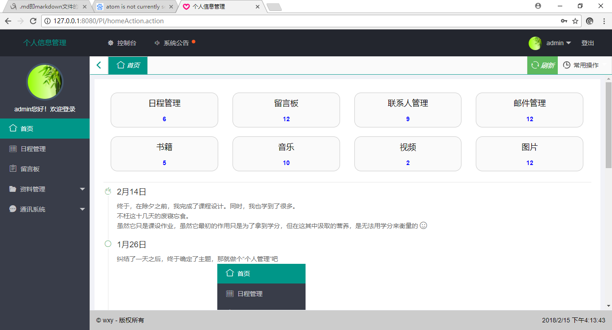

# PI
## 基于SSH的个人信息管理系统
---
> * 开发环境
> > 1. window 10
> > 2. tomcat 8.0
> > 3. MySql 5.7
> > 4. MyEclipse 2014
> * SSH框架版本
> > * struts 2.1
> > * spring 3.1
> > * hibernate 3.3

### 界面展示
> 登录界面
* *登录过程中实现了拦截器*
* *可判断该页面是否顶层，若不是，则将该页面设为顶级页面*
```
$(function(){
	//session过期自动检测，如果当前框架不是顶层，则将顶层设置为此页面
	if(window != top){
		top.location.href = location.href;
	}
});
```


> 主页
* *显示总结性内容*
* *时间线*


> 日程管理


> 书籍


...
> 联系人


